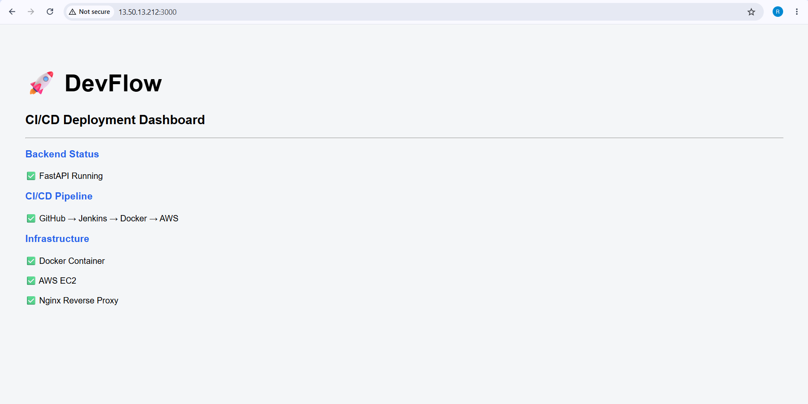

# 🚀 DevFlow - Self Service DevOps Platform

> A complete Full Stack DevOps CI/CD and Monitoring Platform built using **FastAPI, React, Docker, Jenkins, GitHub, Docker Hub, Kubernetes, Prometheus, Grafana, and AWS EC2**.


# 📌 Project Overview

DevFlow is a Self-Service DevOps Platform that automates the complete software deployment lifecycle.

Whenever a developer pushes code to GitHub, Jenkins automatically:

- Pulls the latest source code
- Builds Docker images
- Pushes images to Docker Hub
- Deploys containers on AWS EC2
- Runs applications using Kubernetes
- Monitors infrastructure using Prometheus and Grafana


This project demonstrates a real-world production-style DevOps workflow including CI/CD automation, containerization, orchestration, and monitoring.


# 🏗 Architecture


```
                         Developer
                             |
                             |
                             ▼

                    GitHub Repository

                             |
                             |
                    GitHub Webhook

                             |
                             ▼

                     Jenkins Pipeline

                             |
                             |
              -----------------------------
              |                           |
              ▼                           ▼

        Docker Build                CI/CD Automation

              |
              ▼

          Docker Hub

              |
              ▼

          AWS EC2 Server

              |
              ▼

        Kubernetes Cluster

              |
      ----------------------
      |                    |
      ▼                    ▼

FastAPI Backend       React Frontend


              |
              ▼

        Monitoring Stack

              |
      ----------------------
      |                    |
      ▼                    ▼

 Prometheus          Grafana

              |
              ▼

        Node Exporter Metrics
```


# ⚙ Tech Stack


## Backend

- FastAPI
- Python 3
- Uvicorn


## Frontend

- React
- HTML
- CSS
- JavaScript


## DevOps

- Jenkins
- Docker
- Docker Compose
- GitHub Webhooks
- Kubernetes


## Cloud

- AWS EC2
- Ubuntu Server


## Container Registry

- Docker Hub


## Monitoring

- Prometheus
- Grafana
- Node Exporter


## Version Control

- Git
- GitHub


# 📂 Project Structure


```
devflow-platform/

│

├── backend/

│   ├── Dockerfile

│   ├── requirements.txt

│   └── main.py


├── frontend/


├── kubernetes/


├── monitoring/

│   ├── prometheus/

│   ├── grafana/

│   └── node-exporter/


├── images/


├── Jenkinsfile


├── docker-compose.yml


└── README.md

```


# 🚀 Features


- ✅ FastAPI REST API
- ✅ React Frontend
- ✅ Dockerized Application
- ✅ Docker Compose Support
- ✅ Jenkins CI/CD Pipeline
- ✅ GitHub Webhook Integration
- ✅ Automated Docker Image Build
- ✅ Docker Hub Image Push
- ✅ AWS EC2 Deployment
- ✅ Kubernetes Deployment
- ✅ Kubernetes Services
- ✅ Prometheus Monitoring
- ✅ Node Exporter Metrics
- ✅ Grafana Dashboard
- ✅ Infrastructure Monitoring
- ✅ Live Application Deployment


# 🔄 CI/CD Workflow


```
Developer

    |

    ▼

GitHub Repository

    |

    ▼

GitHub Webhook

    |

    ▼

Jenkins Pipeline

    |

    ▼

Checkout Source Code

    |

    ▼

Docker Build

    |

    ▼

Push Image

    |

    ▼

Docker Hub

    |

    ▼

Kubernetes Deployment

    |

    ▼

Application Running

    |

    ▼

Prometheus + Grafana Monitoring

```


# 📸 Project Screenshots


## GitHub Repository


## Jenkins Dashboard


## Jenkins Pipeline


## Docker Images


## Running Docker Containers


## AWS EC2 Instance


## Backend API


## Frontend Dashboard




## Prometheus Monitoring


## Grafana Dashboard


# 🛠 Installation


## Clone Repository


```bash
git clone https://github.com/patnamraveendra1-beep/devflow-platform.git

cd devflow-platform
```


# Backend Setup


```bash
cd backend

python -m venv venv

source venv/bin/activate

pip install -r requirements.txt

uvicorn main:app --reload
```


# Frontend Setup


```bash
cd frontend

npm install

npm start
```


# Run using Docker Compose


```bash
docker-compose up --build
```


# ☁ AWS Deployment


Deployment Steps:


- Launch Ubuntu EC2 Instance
- Install Docker
- Install Jenkins
- Configure GitHub Webhook
- Build Docker Images
- Push Images to Docker Hub
- Deploy Containers
- Configure Kubernetes
- Setup Monitoring Stack


# 🔐 Jenkins Credentials


Configured Credentials:


- GitHub Credentials
- Docker Hub Credentials


# 📊 Monitoring Stack


DevFlow uses Prometheus and Grafana for monitoring.


```
Application

      |

      ▼

Node Exporter

      |

      ▼

Prometheus

      |

      ▼

Grafana Dashboard

```


Monitoring Metrics:


- CPU Usage
- Memory Usage
- Disk Usage
- Network Traffic
- System Health
- Container Metrics


# 🌐 Live Demo


## Frontend

```
http://13.50.13.212:3000
```


## Backend API

```
http://13.50.13.212:8000
```


# 📈 Project Status


| Module | Status |
|---|---|
| FastAPI Backend | ✅ Completed |
| React Frontend | ✅ Completed |
| Docker | ✅ Completed |
| Docker Compose | ✅ Completed |
| Jenkins CI/CD | ✅ Completed |
| GitHub Webhook | ✅ Completed |
| Docker Hub | ✅ Completed |
| AWS EC2 Deployment | ✅ Completed |
| Kubernetes Deployment | ✅ Completed |
| Kubernetes Services | ✅ Completed |
| Prometheus Monitoring | ✅ Completed |
| Node Exporter | ✅ Completed |
| Grafana Dashboard | ✅ Completed |


# 🔮 Future Enhancements


- Terraform Infrastructure as Code
- Helm Charts
- Kubernetes Ingress
- HTTPS using Nginx
- Custom Domain Name
- SonarQube Code Analysis
- Trivy Security Scanning
- Alert Manager Integration
- Blue Green Deployment
- Automated Rollback Strategy


# 👨‍💻 Author


## Raveendra Patnam


**DevOps Engineer | AWS | Docker | Jenkins | Kubernetes | Terraform | Python**


GitHub:

https://github.com/patnamraveendra1-beep


LinkedIn:

(Add your LinkedIn profile here)


# ⭐ If you like this project


Please give this repository a ⭐ on GitHub.


# 📜 License


This project is developed for learning, portfolio, and DevOps practice purposes.


© 2026 Raveendra Patnam
