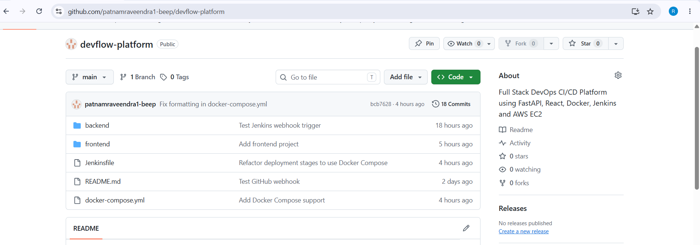
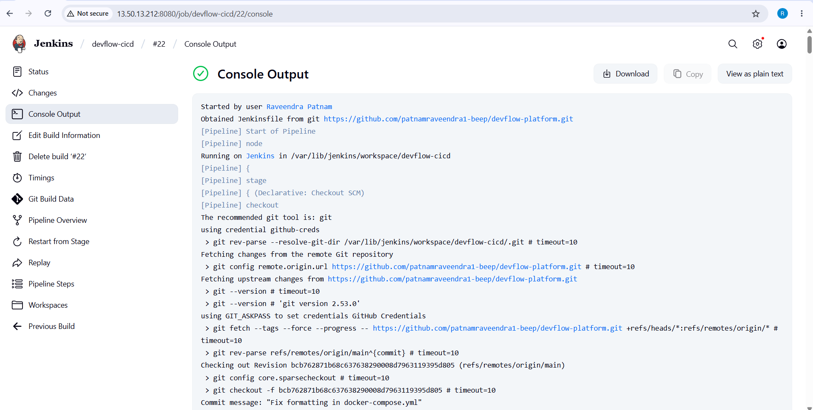
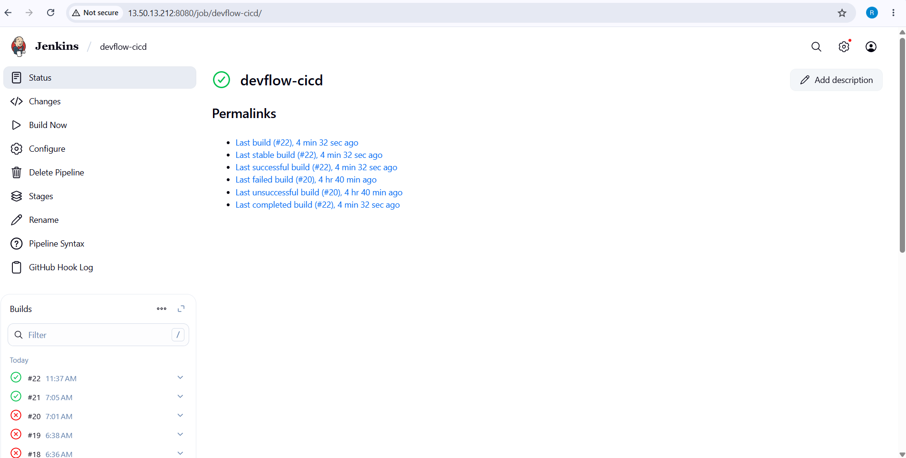
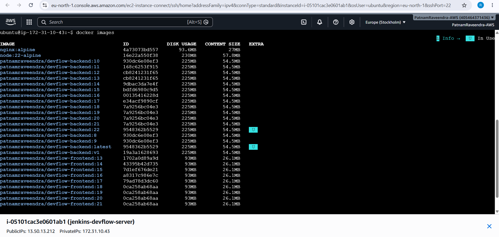
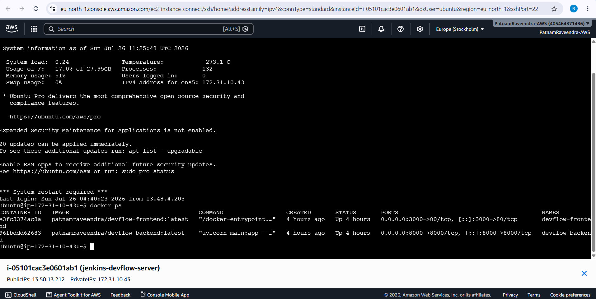
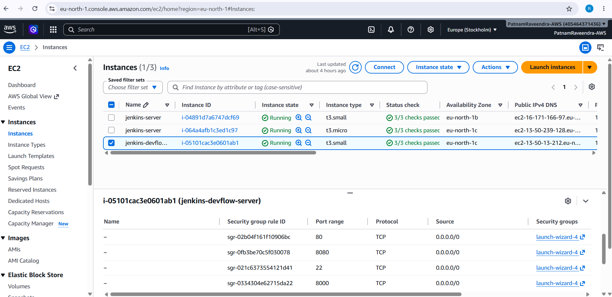
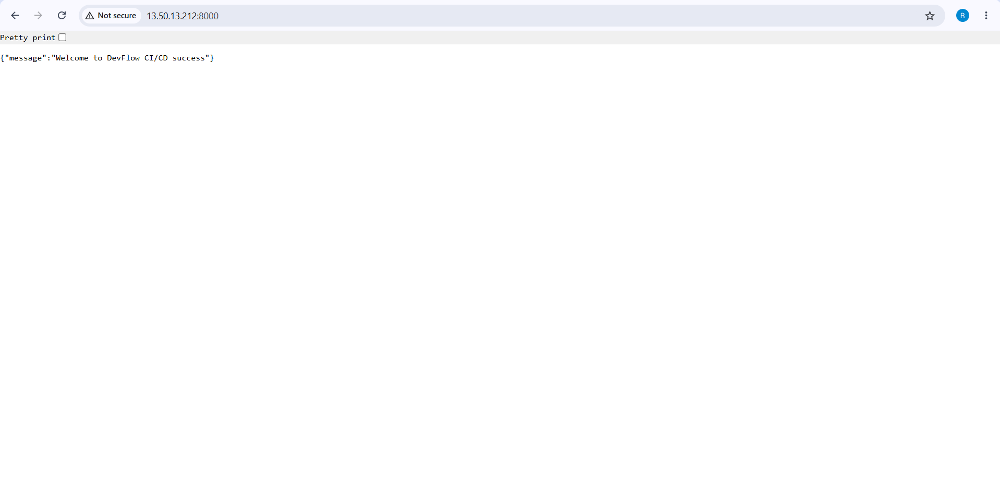
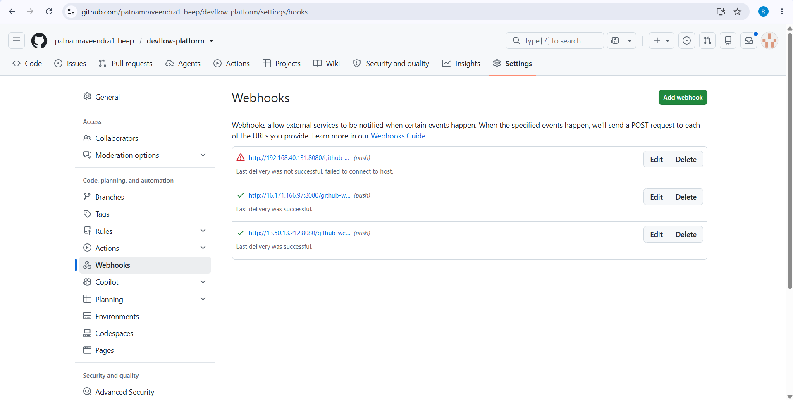

# 🚀 DevFlow - Self Service DevOps Platform

> A complete Full Stack DevOps CI/CD Platform built using **FastAPI, React, Docker, Jenkins, GitHub, Docker Hub, and AWS EC2**.

---

# 📌 Project Overview

DevFlow is a Self-Service DevOps Platform that automates the software deployment lifecycle.

Whenever a developer pushes code to GitHub, Jenkins automatically:

- Pulls the latest source code
- Builds a Docker image
- Pushes the image to Docker Hub
- Deploys the latest container on AWS EC2

This project demonstrates a real-world CI/CD workflow used in production DevOps environments.

---

# 🏗 Architecture

```
                Developer
                    │
                    ▼
             GitHub Repository
                    │
           GitHub Webhook Trigger
                    │
                    ▼
             Jenkins Pipeline
                    │
          Checkout Source Code
                    │
                    ▼
            Docker Image Build
                    │
                    ▼
              Docker Hub
                    │
                    ▼
          AWS EC2 Deployment
                    │
                    ▼
      FastAPI Backend + React Frontend
```

---

# ⚙ Tech Stack

## Backend

- FastAPI
- Python 3
- Uvicorn

## Frontend

- React
- HTML
- CSS
- JavaScript

## DevOps

- Jenkins
- Docker
- Docker Compose
- GitHub Webhooks

## Cloud

- AWS EC2
- Ubuntu Server

## Container Registry

- Docker Hub

## Version Control

- Git
- GitHub

---

# 📂 Project Structure

```
devflow-platform/
│
├── backend/
│   ├── Dockerfile
│   ├── requirements.txt
│   └── main.py
│
├── frontend/
│
├── docker/
│
├── kubernetes/
│
├── terraform/
│
├── jenkins/
│
├── monitoring/
│
├── screenshots/
│
├── Jenkinsfile
├── docker-compose.yml
└── README.md
```

---

# 🚀 Features

- ✅ FastAPI REST API
- ✅ React Frontend
- ✅ Dockerized Application
- ✅ Docker Compose Support
- ✅ Jenkins CI/CD Pipeline
- ✅ GitHub Webhook Integration
- ✅ Docker Hub Image Push
- ✅ AWS EC2 Deployment
- ✅ Automatic Docker Deployment
- ✅ Live Application

---

# 🔄 CI/CD Workflow

```
Developer
     │
     ▼
GitHub Repository
     │
     ▼
GitHub Webhook
     │
     ▼
Jenkins Pipeline
     │
     ▼
Checkout Source
     │
     ▼
Docker Build
     │
     ▼
Push Image
     │
     ▼
Docker Hub
     │
     ▼
Deploy on AWS EC2
     │
     ▼
Application Running
```

---

# 📸 Project Screenshots

## GitHub Repository



---

## Jenkins Dashboard



---

## Jenkins Pipeline



---

## Docker Images



---

## Running Docker Containers



---

## AWS EC2 Instance



---

## Backend API



---

## Frontend Dashboard


---

## GitHub Webhook



---

# 🛠 Installation

## Clone Repository

```bash
git clone https://github.com/patnamraveendra1-beep/devflow-platform.git

cd devflow-platform
```

---

## Backend Setup

```bash
cd backend

python -m venv venv

source venv/bin/activate

pip install -r requirements.txt

uvicorn main:app --reload
```

---

## Frontend Setup

```bash
cd frontend

npm install

npm start
```

---

## Run using Docker Compose

```bash
docker-compose up --build
```

---

# ☁ AWS Deployment

Deployment Steps:

- Launch Ubuntu EC2 Instance
- Install Docker
- Install Jenkins
- Configure GitHub Webhook
- Build Docker Image
- Push Image to Docker Hub
- Deploy Docker Container

---

# 🔐 Jenkins Credentials

Configured Credentials:

- GitHub Credentials
- Docker Hub Credentials

---

# 🌐 Live Demo

## Frontend

```
http://13.50.13.212:3000
```

## Backend

```
http://13.50.13.212:8000
```

---

# 📈 Project Status

| Module | Status |
|---------|--------|
| FastAPI Backend | ✅ Completed |
| React Frontend | ✅ Completed |
| Docker | ✅ Completed |
| Docker Compose | ✅ Completed |
| Jenkins CI/CD | ✅ Completed |
| GitHub Webhook | ✅ Completed |
| Docker Hub | ✅ Completed |
| AWS EC2 Deployment | ✅ Completed |
| Kubernetes | 🚧 Planned |
| Terraform | 🚧 Planned |
| Prometheus | 🚧 Planned |
| Grafana | 🚧 Planned |

---

# 🔮 Future Enhancements

- Kubernetes Deployment
- Kubernetes Service
- Kubernetes Ingress
- Terraform Infrastructure as Code
- Prometheus Monitoring
- Grafana Dashboard
- Helm Charts
- SonarQube Code Analysis
- Trivy Image Security Scan
- HTTPS using Nginx Reverse Proxy
- Custom Domain Name

---

# 👨‍💻 Author

## Raveendra Patnam

**DevOps | AWS | Docker | Jenkins | Kubernetes | Terraform | Python**

GitHub:

https://github.com/patnamraveendra1-beep

LinkedIn:

(Add your LinkedIn profile here)

---

# ⭐ If you like this project

Please give this repository a ⭐ on GitHub.

---

## 📜 License

This project is developed for learning, portfolio, and DevOps practice purposes.

© 2026 Raveendra Patnam
